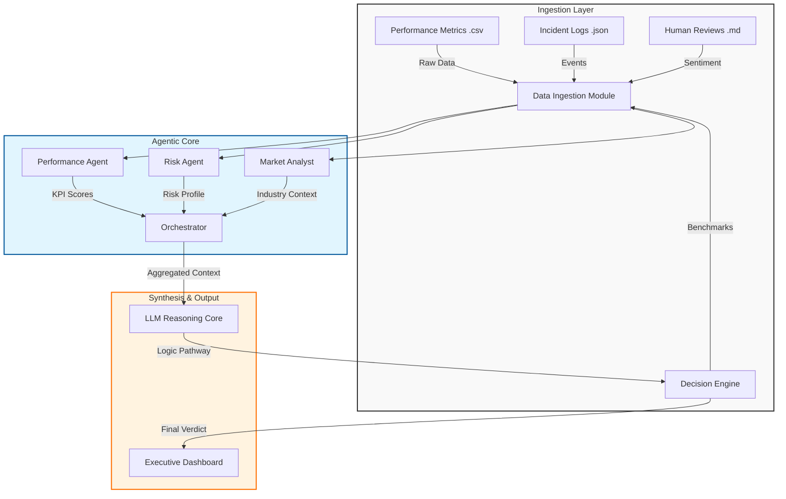

# Agentic AI Contracts Specialist: Intelligence Hub 🚀

[]()
[]()
[]()
[]()
[]()

An advanced **Agentic AI** platform designed to automate and deepen contract performance evaluation. Moving beyond simple data visualization, this system functions as an **Autonomous Contracts Agent**, utilizing Large Language Models (LLMs) to reason through complex, multi-source data to provide executive-level insights and audit-ready recommendations.

---

## 🌟 Executive Summary

The **Intelligence Hub** is a next-generation vendor management system that scales the expertise of a Senior Contracts Specialist. It doesn't just show you metrics; it understands the "Why" behind them. By synthesizing quantitative performance data with qualitative human feedback and market context, the system provides a comprehensive **Logic Pathway** for every contract decision—functioning effectively as a 24/7 digital auditor.

---

## 🎯 The Use Case: Why Agentic AI?

### The Challenge: The "Manual Evaluation" Trap
Contract evaluation is traditionally a highly inefficient and high-friction process:
*   **Exhausting & Repetitive**: Senior specialists waste hundreds of hours manually cross-referencing CSV logs, PDF contracts, and email chains.
*   **Subjective & Inconsistent**: Evaluations often depend on *who* is reviewing the file, leading to variable standards and biased outcomes.
*   **Reactive Blind Spots**: Human evaluators often miss subtle patterns or "slow leaks" in performance until they become critical failures.
*   **Audit Gaps**: Decisions are made in meetings with no clear, data-backed evidence trail preserved for future audits.

### The Solution: The "Agentic" Advantage
Why move beyond simple automation? Traditional scripts can calculate uptime, but they cannot *think*. Our Agentic AI mirrors the behavior of a human specialist:

| Feature | Traditional Automation 🤖 | Agentic AI (Intelligence Hub) 🧠 |
| :--- | :--- | :--- |
| **Logic Model** | Rigid `if/then` scripts | **Reasoning Engines** (LLMs) that understand nuance |
| **Data Scope** | Structured DBs only | **Multi-Modal**: Reads CSVs, JSON logs, & human Feedback |
| **Conflict Resolution** | Flags errors blindly | **Investigates Context**: "Was this a vendor failure or a market issue?" |
| **Output** | Static Dashboards | **Strategic Decisions**: "Renew with conditions" vs "Terminate" |
| **Auditability** | Black-box calculations | **Explainable AI**: Citations for every single claim |

### Standardization & Fairness
By replacing subjective human reviews with this Agentic framework, you ensure:
*   **Zero Bias**: Every vendor is judged by the exact same rigorous standards.
*   **Instant Audits**: Decisions are backed by a transparent "Logic Pathway," citing specific data points (e.g., *"Score dropped 15% in Q3 due to incident #402"*).

---

## 🏗️ System Architecture

The system follows a multi-agent orchestration pattern to ensure specialized handling of different data types before synthesizing a final verdict.



---

## 🚀 Key Features

*   **Autonomous Audit Logic**: Real-time LLM reasoning triggered instantly upon vendor selection.
*   **Explainable AI (XAI)**: A transparent 5-step "Logic Pathway" revealing the Agent's specific reasoning process.
*   **Multi-Modal Synthesis**: Combines structured data (Excel/CSV) with unstructured text (Reviews/Incidents) for a holistic view.
*   **Surgical Extraction**: Advanced JSON engines ensure high-fidelity reporting even with massive data payloads.
*   **Executive Dashboard**: A premium, high-contrast React interface designed for C-level rapid decision-making.

---

## 🛠️ Tech Stack

| Component | Technology | Description |
| :--- | :--- | :--- |
| **Backend** | **FastAPI** (Python 3.10+) | High-performance async API for multi-agent orchestration. |
| **Frontend** | **React** (Vite) | FAST, modern UI with real-time state management. |
| **Intelligence** | **Google Gemini 2.0 Flash** | Primary reasoning engine (via `google-genai` SDK). |
| **Fallback** | **Ollama / Azure OpenAI** | Configurable support for local or alternative cloud LLMs. |
| **Styling** | **Vanilla CSS** | Custom Glassmorphism design system for a premium feel. |
| **Data** | **CSV / JSON** | Lightweight, persistence-enabled file storage for easy portability. |

---

## 🏁 Getting Started

### Prerequisites
*   **Python**: 3.9 or higher
*   **Node.js**: 18 or higher
*   **API Key**: A valid [Google Gemini API Key](https://aistudio.google.com/) (or Azure/Ollama setup).

### 1. Repository Setup
```powershell
git clone https://github.com/your-org/daleel-contracts-agent.git
cd daleel-contracts-agent
```

### 2. Backend Installation
```powershell
# Create virtual environment
python -m venv venv
.\venv\Scripts\Activate.ps1

# Install dependencies
pip install -r requirements.txt

# Configure Environment
# Create a .env file in the root directory
echo "GEMINI_API_KEY=your_actual_api_key_here" > .env

# Start the Agent Service
python src/app.py
```
*The backend API will start at `http://localhost:8000`*

### 3. Frontend Installation
Open a new terminal configuration:
```powershell
cd frontend
npm install

# Start the Dashboard
npm run dev
```
*The UI will be available at `http://localhost:3000`*

---

## ⚙️ Configuration

The system is highly configurable via `config.yaml`. You can adjust model parameters, thresholds, and providers without touching the code.

```yaml
llm:
  provider: gemini  # Options: 'gemini', 'ollama', 'azure'
  gemini:
    model: gemini-2.0-flash-exp
    temperature: 0.3 # Lower for more deterministic/factual audits

agents:
  max_retries: 3
  confidence_threshold: 0.6 # Minimum confidence to auto-approve
```

---

## 🧪 Testing

Run the automated test suite to verify agent logic and API endpoints.

```powershell
# Run all tests
pytest

# Run only agent logic tests
pytest tests/test_agents.py
```

---

## 🔧 Troubleshooting

### Common Issues

1.  **"API Key not found" Error**:
    *   Ensure your `.env` file is in the **root** directory (not in `src`).
    *   Restart the backend terminal after creating the `.env` file.

2.  **Frontend shows "Network Error"**:
    *   Verify the backend is running on port `8000`.
    *   Check if your firewall is blocking local connections.

3.  **LLM Responses are slow**:
    *   `gemini-2.0-flash` is recommended for speed.
    *   Check your internet connection strength.

---

## 🗺️ Roadmap & Future Enhancements

*   [ ] **PDF Contract Parsing**: Direct ingestion of legal PDF documents using `pypdf`.
*   [ ] **Excel Integration**: Native support for complex financial spreadsheets via `openpyxl`.
*   [ ] **Historical Trending**: Long-term storage of evaluation history for year-over-year analysis.
